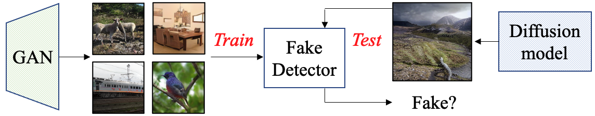

# Detecting fake images

**Towards Universal Fake Image Detectors that Generalize Across Generative Models** <br>
[Utkarsh Ojha*](https://utkarshojha.github.io/), [Yuheng Li*](https://yuheng-li.github.io/), [Yong Jae Lee](https://pages.cs.wisc.edu/~yongjaelee/) <br>
(*Equal contribution) <br>
CVPR 2023

[[Project Page](https://utkarshojha.github.io/universal-fake-detection/)] [[Paper](https://arxiv.org/abs/2302.10174)]

<p align="center">
    <a href="https://utkarshojha.github.io/universal-fake-detection/">></a> <br>
    Using images from one type of generative model (e.g., GAN), detect fake images from other <i>breeds</i> (e.g., Diffusion models)
</p>

## Contents

- [Setup](#setup)
- [Pretrained model](#weights)
- [Data](#data)
- [Evaluation](#evaluation)
- [Training](#training)


## Setup 

1. Clone this repository 
```bash
git clone https://github.com/Yuheng-Li/UniversalFakeDetect
cd UniversalFakeDetect
```

2. Install the necessary libraries
```bash
pip install torch torchvision
```

## Data
- Your dataset should be formatted as txt files with (path, label) pairs:
  - Train: `/home/wangz/zgh/dataset/train_list.txt`
  - Test: `/home/wangz/zgh/dataset/test_list.txt`
  - Format: `./dataset/real/celebahq/1323.jpg\t0` (path and class ID separated by tab)

## Evaluation
- Run evaluation with:
```bash
python validate.py  --arch=CLIP:ViT-L/14   --ckpt=pretrained_weights/fc_weights.pth   --result_folder=clip_vitl14 --real_path=/home/wangz/zgh/dataset/test_list.txt --fake_path=/home/wangz/zgh/dataset/test_list.txt
```

## Training
- Train with 11 classes:
```bash
python train.py --name=clip_vitl14_multiclass --data_mode=your_custom_data --arch=CLIP:ViT-L/14 --n_classes=11 --fix_backbone
```
- **Important**: Use `--n_classes=11` for your dataset

## Acknowledgement

We would like to thank [Sheng-Yu Wang](https://github.com/PeterWang512) for releasing the real/fake images from different generative models. Our training pipeline is also inspired by his [open-source code](https://github.com/PeterWang512/CNNDetection). We would also like to thank [CompVis](https://github.com/CompVis) for releasing the pre-trained [LDMs](https://github.com/CompVis/latent-diffusion) and [LAION](https://laion.ai/) for open-sourcing [LAION-400M dataset](https://laion.ai/blog/laion-400-open-dataset/).

## Citation

If you find our work helpful in your research, please cite it using the following:
```bibtex
@inproceedings{ojha2023fakedetect,
      title={Towards Universal Fake Image Detectors that Generalize Across Generative Models}, 
      author={Ojha, Utkarsh and Li, Yuheng and Lee, Yong Jae},
      booktitle={CVPR},
      year={2023},
}
```
